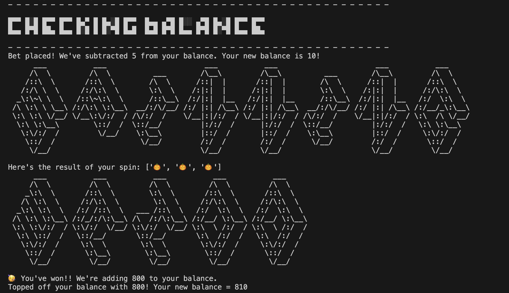

# Vegas-Style Slot Machine

A simple Vegas-style electronic slot machine built with Python. This project is perfect for beginners learning Python and simulates a slot machine game play with betting and payouts.

## Features

- Simulates game play
- Allows the user to place bets
- Handles invalid user input
- Tracks user balance
- Calculates winnings based on matching symbols
- Simple text-based interface

## How It Works

1. The player starts with a balance of $100.
2. The player places a bet for each spin.
3. The slot machine "spins" to match a tuple of defined symbols with specific payouts.
4. Winnings are calculated based on the pattern of symbols matched.
5. The game ends when the player runs out of balance and chooses to quit.

## Libraries Leveraged

1. [art][https://pypi.org/project/art/]

## Setup & Play Instructions

1. Clone this repository or copy the code into a file named `slot_machine.py`.
2. Install Python (version 3.6 or later).
   ```
   brew install python3
   ```
3. If using VS Code - set up a virtual environment (https://code.visualstudio.com/docs/python/python-tutorial)
4. Activate the virtual environment - if necessary
   ```
   source .venv/bin/activate
   ```
5. Run the script in your terminal:
   ```bash
   python3 slot_machine.py
   ```

## Screenshot


